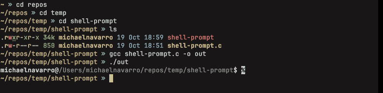
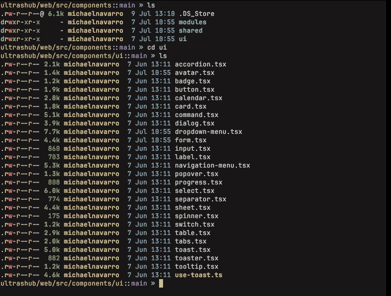
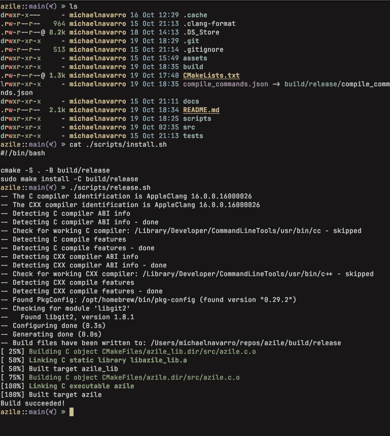

# Azile

> Note: This has only been tested on ARM based MacOS with Zsh.*

## Table of Contents
- [Quick Start](#quick-start)
- [Overview](#overview)
- [Install](#install)
    - [Install From Source](#install-from-source)
- [Customization](#customization)
- [Contributing](#contributing)
- [License](#license)

## Quick Start

### Step 1: Get Azile binary file on your system. Checkout how to [install](#install) Azile below.

### Step 2. Set up your shell to use Azile

Configure your shell to initialize Azile. Select yours from the list below:

<details>
<summary>Zsh</summary>
Add the following to the end of `~/.zshrc`:

```sh
eval "$(azile zsh)"
```

</details>

## Overview

A very simple shell prompt configured to the exact design that I like. Refer to
the images below.

### Non-git repo



### Git repo



### Git repo with un-clean working tree



## Install

### Dependencies

- [Nerd Fonts](https://www.nerdfonts.com/) to render special icons
- [libgit2](https://github.com/libgit2/libgit2) for git support

### Install From Source

1. Clone the repo

```sh 
git clone https://github.com/navazjm/azile.git
```

2. cd into Azile

```sh 
cd azile
```

#### MacOS & Linux

Either run the install script or manually build with CMake

##### Script

1. Run the install script 

```sh 
sudo ./scripts/install.sh
```

> Note: The install script runs the commands found in the following CMake section.
> Use `sudo` to move `Azile` executable into `/usr/local/bin/`. This requires
> elevated privileges and allows you to use `Azile` from any directory

##### CMake  

1. Run cmake

```sh 
cmake -S . -B build/release
```

3. Run make install

```sh 
sudo make install -C build/release
```

> Note: Use `sudo` to move `Azile` executable into `/usr/local/bin/`. This requires
> elevated privileges and allows you to use `Azile` from any directory

## Customization

Make Azile truly yours! Head over to our [customization guide](./docs/customization.md) to get started.

## Contributing 

Want to contribute to Azile? Awesome, we would love your input ♥\
\
If you have a feature request, start a [discussion](https://github.com/navazjm/azile/discussions),
and we can work together to incorporate it into Azile!\
\
Encountered a defect? Please report it under [issues](https://github.com/navazjm/azile/issues).
Be sure to include detailed information to help us address the issue effectively.\
\
Want to implement a feature request or fix a defect? Checkout our [contributing guide](./docs/contributing.md).

## License

Azile is licensed under [MIT](./LICENSE)
